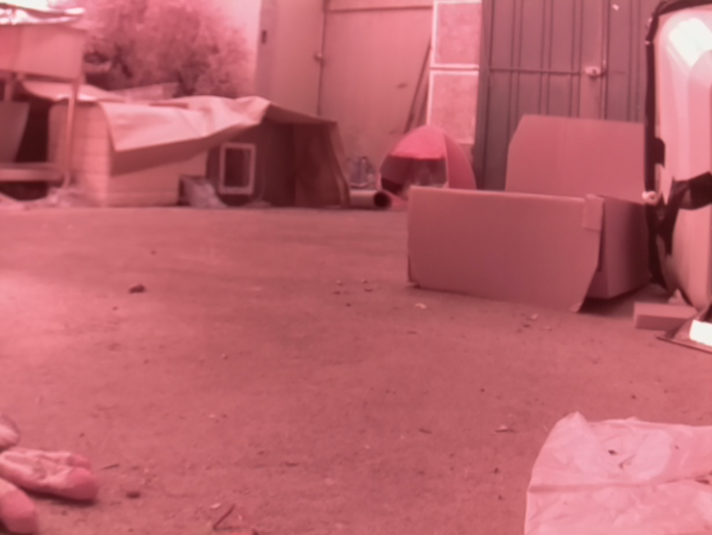
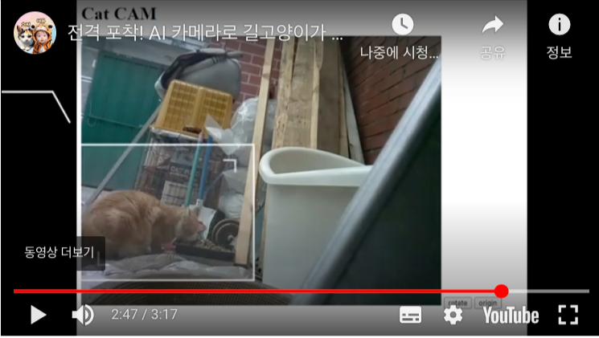

# Cct Tracer Pythoon

- 웹사이트상의 스트리밍 영상에 고양이가 나타나면 이를 캡쳐해서 저장합니다.
- MediaPipe, Tensoflow Lite를 이용해서 고양이를 판독합니다.

## 개발하게 된 계기

- 아래 글에 개발하게 된 이유가 설명되어 있습니다.
    - [MediaPipe와 Selenium을 이용해서 웹 CCTV 영상속 고양이 포착하기](https://reddol18.pe.kr/cat-detection-by-mediapipe-with-selenium)

## 실행하기 전에 필요한 것

- scr_cap.py의 아래 부분에 영상의 URL을 입력합니다.
  - ``driver.get("** your web streaming url **")``

## 실행방법

- 아래와 같은 스트리밍 화면에서 디텍팅을 한다고 예시를 들어보겠습니다. 
  - 
- 파이선 파일을 실행합니다.
  - ``python scr_cap.py``
- 화면에 고양이가 나타나면 캡쳐화면이 저장됩니다.
  - 

## 사용된 기술

- mediapipe
- selenium web driver

## 앞으로의 계획

- 판독 루틴을 쓰레드로 동작시키기
- 디텍팅 대상 확장

